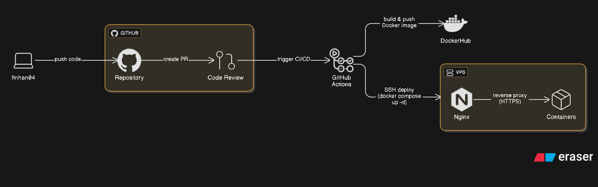

# 🛍️ iTribe E-Commerce Platform

A full-stack, enterprise-grade e-commerce platform built with **.NET 8** and **Next.js 14** — offering real-time payment processing, scalable architecture, and secure customer experiences.

> 💼 This project demonstrates my skills in backend scalability, frontend architecture, secure payments, and production-ready DevOps. Designed as a showcase of real-world engineering standards.

---

## 🚀 Overview

`iTribe` is a modern online retail platform built to handle the full lifecycle of e-commerce operations:

- 👥 Multi-role user management (admin/customer)
- 🛍️ Product catalog with variants, inventory, and filtering
- 🧾 Seamless order management & payment flows
- 🔐 Security-first approach with JWT, rate limiting, and encrypted sessions

---

## ✨ Key Features

### 🛒 **E-Commerce Core**
- Dynamic product & variant management
- Real-time inventory checks & persistent cart
- Order tracking with status history
- Role-based access control (RBAC)

### 💳 **Payment Integration**
- Stripe & MoMo gateways with webhook validation
- Full refund workflows
- Transaction status syncing with order updates

### 🛡️ **Security**
- JWT + refresh token strategy
- Rate limiting & brute-force protection
- XSS, CSRF & injection mitigations
- CSP headers + encrypted storage

---

## 🛠️ Technology Stack

  

- **Backend**: .NET 8 (.Net Core Web API), EF Core, MongoDB, Redis, Cloudinary
- **Frontend**: Next.js 14, TypeScript, Redux Toolkit, TanStack Query, Zod, Tailwind CSS
- **DevOps**: Docker, GitHub Actions, Nginx, Ubuntu

---

## 🧠 What I Focused On

- **Clean Architecture**: DI, Repository-Service pattern, layered separation
- **Security**: Full JWT auth flow, input sanitization, secure cookies
- **Payments**: Modular integration with Stripe & MoMo; refund API design
- **Frontend Engineering**: SSR-friendly architecture, optimized UI/UX, accessible components
- **Performance**: Redis caching, lazy loading, Dockerized CI/CD flow

---

## 🏗️ Architecture Highlights

- Modular service-oriented design
- Environment-based configuration (dev/prod)
- Secure deployments with HTTPS, Nginx reverse proxy
- Health checks, logging & backup-ready

---

## 🚀 CI/CD & Deployment Workflow

Below is the automated workflow for code delivery and deployment to the production VPS:

### 📊 Deployment Flow Diagram

---

